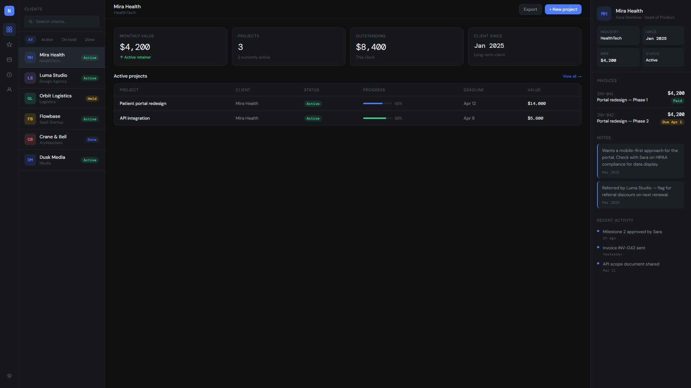

# Nucleus CRM

A studio-grade client relationship management dashboard built for small digital agencies and freelance studios. Manage clients, track active projects, monitor invoices, and log activity — all in one clean interface.

**Live demo → [rinlabsx.github.io/nucleus-crm](https://rinlabsx.github.io/nucleus-crm)**

---

## What it does

- Client list with status filtering and search
- Per-client drill-down: metrics, active projects, invoices, notes, and activity feed
- Studio overview with aggregate KPIs: MRR, active clients, open projects, outstanding invoices
- Project tracker with progress bars, deadlines, and status badges
- Invoice management with payment status tracking
- Internal notes and timestamped activity log per client

## Tech stack

- Vanilla HTML, CSS, JavaScript — no framework, no dependencies
- Single-file architecture, opens directly in any modern browser
- Fully responsive data layout with a four-column grid

## Design direction

Dark, data-dense, and professional. Built with DM Sans and DM Mono for a refined editorial feel. Per-client color coding, monochrome base with precise accent colors, and tight typographic hierarchy throughout.

## Running it locally

No installation needed. Download `index.html` and open it in any modern browser.

## Why this exists

This is a portfolio piece demonstrating production-grade frontend development — clean architecture, real data modeling, and a design system built from scratch without any UI library. The kind of internal tool a small agency or studio would commission and use daily.

Built by [Nova R.](https://www.upwork.com/freelancers/~0176f7c51b68d07c0e) — AI-Augmented Full-Stack Developer based in Germany.

---

## License

MIT
